# Echoes of the Unseen

## Description 
Within the digital void, a silent challenge beckons. No maps, no signs only intuition guides. Will you decode the whispers of light and shadow, or succumb to obscurity? Journey forth, unveil the unseen.

## Steps
- Extract the file. It contains a corrupted PNG.
- Open the file in hexedit.
- The first byte is corrupted, it must be `89` but it is `98`.
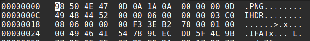
- Save and Run pngcheck with verbose mode.
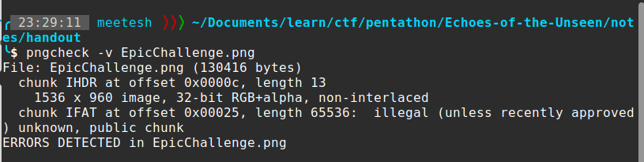
- Change `IFAT` to `IDAT` at offset `0x00025` (IDAT is a valid chuck in the PNG specification)
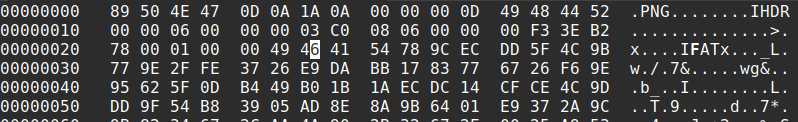
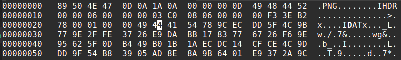

- Save and check again
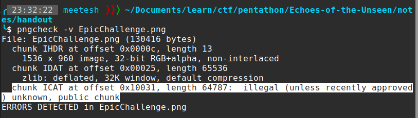
- Change `ICAT` to `IDAT` at offset `0x10031`
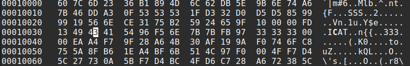
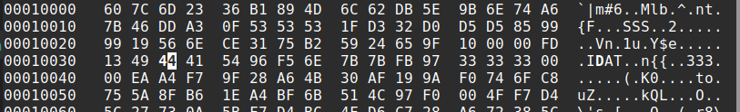

- Save and check again
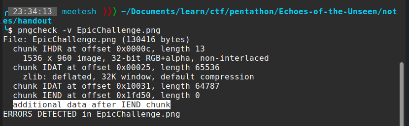

- Remove the trailing data 
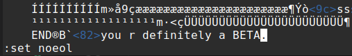
- No errors are detected
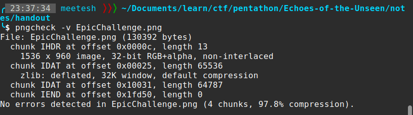

- The image says `I LOVE ALPHA`.
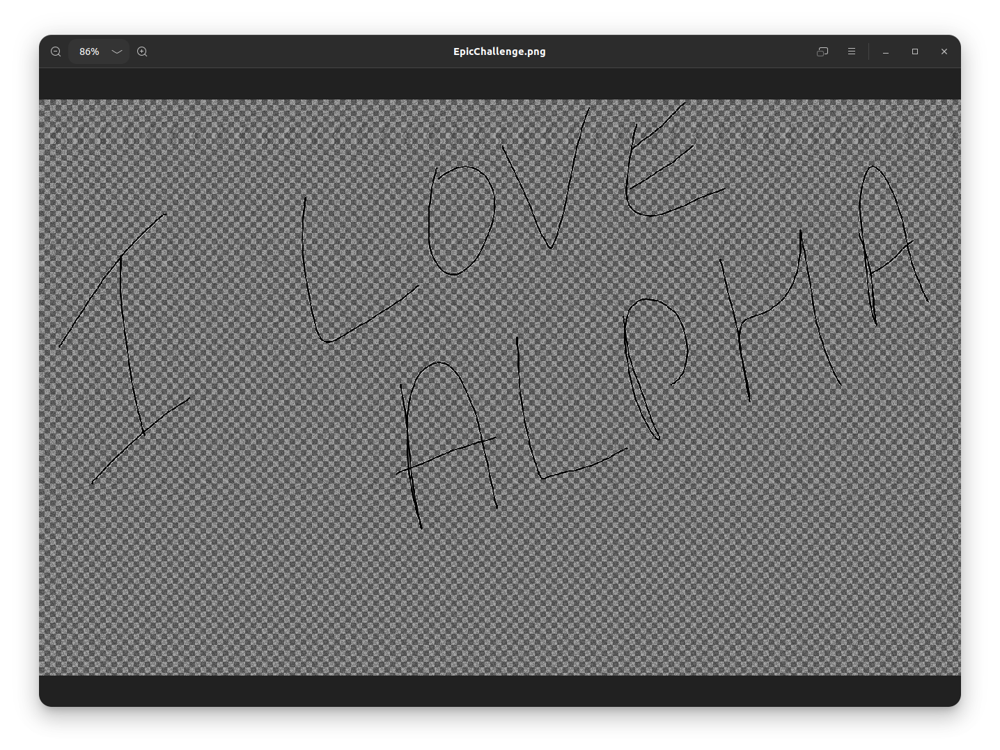

- This hints to something related to alpha channel and the image looks noisy so I ran `zsteg` and got the flag.
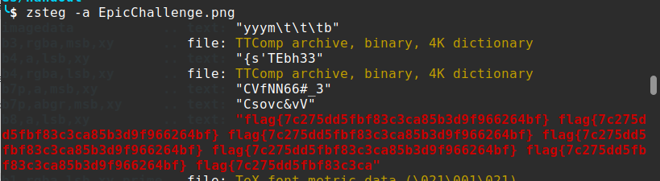