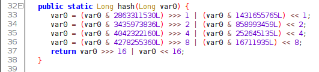

# vBank 3

## Description
vBank also distributed a beta release APK for testing purposes. However, it has come to our attention that the authentication mechanism was implemented with some oversights.

Can you find the PIN to get the flag?

## TL;DR 
- Decompile
- Find hash of admin from database
- Find the PIN of admin using hash function defined in `com/v3/onlinebanking/customer_login_page.class`
- Get the url from `/com/v3/onlinebanking/ViewProfile.class`
- Send request with appropriate parameters and get the flag.

## Steps
- Open `app-release.apk` in ByteCodeViewer
- Saved the decompiled files as zip

- Unzip it 
- In the assets, I found bankDB.db open it using sqlite

- On the main screen of the application, it is asking for `Account number`, `PIN` and `Deployment URL`

- Upon analyzing `com/v3/onlinebanking/customer_login_page$1.class` and `com/v3/onlinebanking/DBHelper.class` I found that the hash of the `PIN` is being compared while authenticating.
line no. 23 in customer_login_page$1.class

DBHelper.class

- `hash` function is defined in `com/v3/onlinebanking/customer_login_page.class`

- I wrote a inverse hash function and passed the hash of the `admin` found from the `bankDB.db` (it is 240658437888736)

PIN of the `admin` is `123456789`

- I logged into the admin's account using these credentials in the app. When I click on the `View Profile`, I got an error, so I viewed its class file.

It was sending the request to the deployment url with some parameters.

- I sent the request to `deployment_url/user/0/?secret=123456789` to get the flag. Here the id `0` is the corresponding id of the admin found from the `bankDB.db`