# Web Exploitation

### Tips before reading 
- Search each and every term you don't understand
- Don't use videos or follow any tutorial to understand concepts (only use them for visualization of how things work)
- For learning offensive security we first need to understand the defensive security to understand the concepts behind breaking the defense and to identify the weak points of the system.

### Prerequisite
- [Overview of HTTP](https://developer.mozilla.org/en-US/docs/Web/HTTP/Overview)
- [What are browser developer tools?](https://developer.mozilla.org/en-US/docs/Learn/Common_questions/Tools_and_setup/What_are_browser_developer_tools)

Following is the brief overview, for the folks who didn't read the 'Overview of HTTP' link completely :grin:.
- HTTP is a fundamental protocol for fetching resources like HTML documents on the Web. 
- HTTP is a client-server protocol: requests are sent by one entity, the user-agent (or a proxy on behalf of it). Most of the time the user-agent is a Web browser, but it can be anything, for example, a robot that crawls the Web to populate and maintain a search engine index.


- HTTP headers make this protocol easy to extend
- HTTP is stateless, but not sessionless
- HTTP request example:
    
- HTTP Respone example:
    


### Solving the Web CTFs 
The process of exploitation is always simple and straightforward, which is not what we are interested in. Instead, we are interested in how to think in a way that leads to finding a solution.

**I will approach challenges with the assumption that I lack prior knowledge.**

We will be solving Natas:
[https://overthewire.org/wargames/natas/](https://overthewire.org/wargames/natas/)

**NOTE: The Natas changes the passwords of the levels periodically, so the following passwords of each level might not work after few days**

#### Level 0
- Get username and password from the home page of natas website
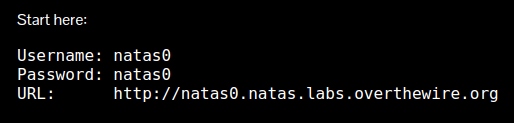
- Login 
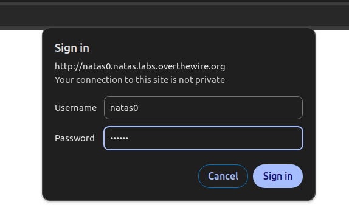
- The page says "You can find the password for the next level on this page."
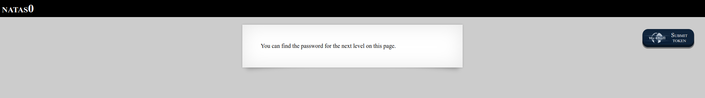
- Using just a google search I found this:
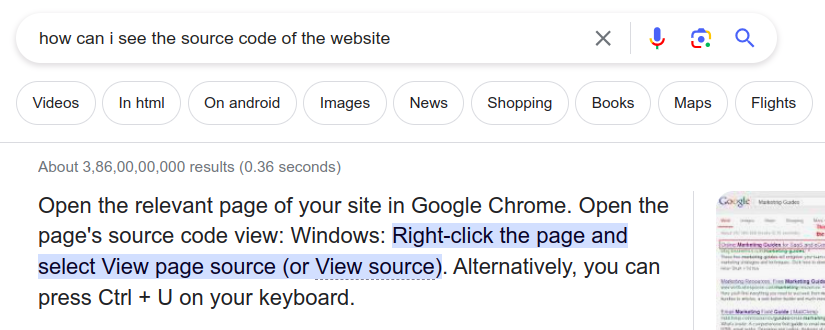
- We found the password in the page source
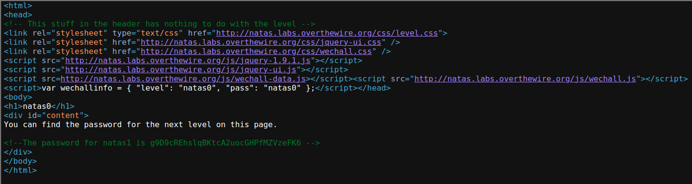
    The line 16 is 
    ```html
    <!--The password for natas1 is g9D9cREhslqBKtcA2uocGHPfMZVzeFK6 -->
    ```

#### Level 1
Username: natas1
Password: g9D9cREhslqBKtcA2uocGHPfMZVzeFK6
URL:      http://natas1.natas.labs.overthewire.org

- The page says, "You can find the password for the next level on this page, but rightclicking has been blocked!"
    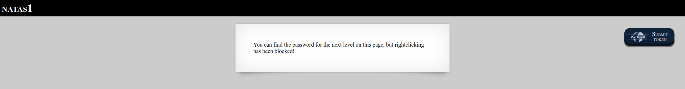
- Let's try right clicking
    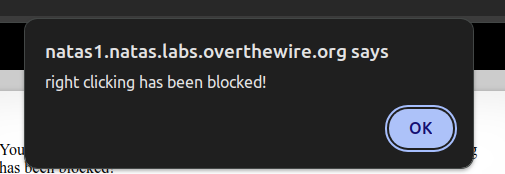
- Press `F12` to open Developer tools 
    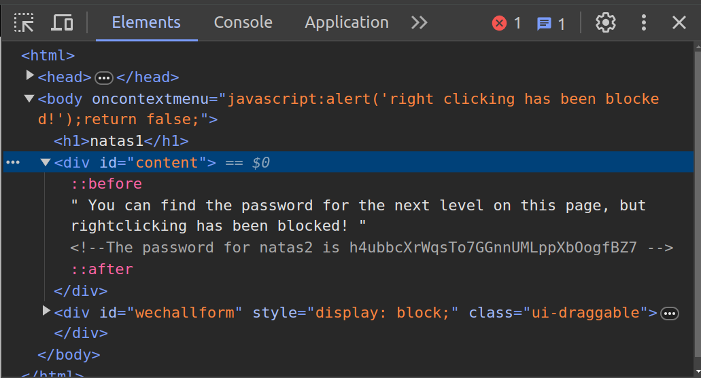
- We found the password
    ```html
    <!--The password for natas2 is h4ubbcXrWqsTo7GGnnUMLppXbOogfBZ7 -->
    ```

#### Level 2
Username: natas2
Password: h4ubbcXrWqsTo7GGnnUMLppXbOogfBZ7
URL:      http://natas2.natas.labs.overthewire.org

- The page says, "There is nothing on this page"
    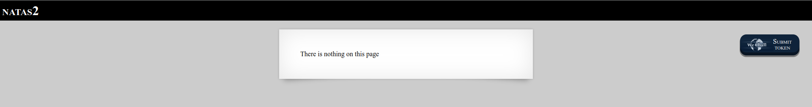
- In developer tools we found there is an image whose path is `files/pixel.png`
    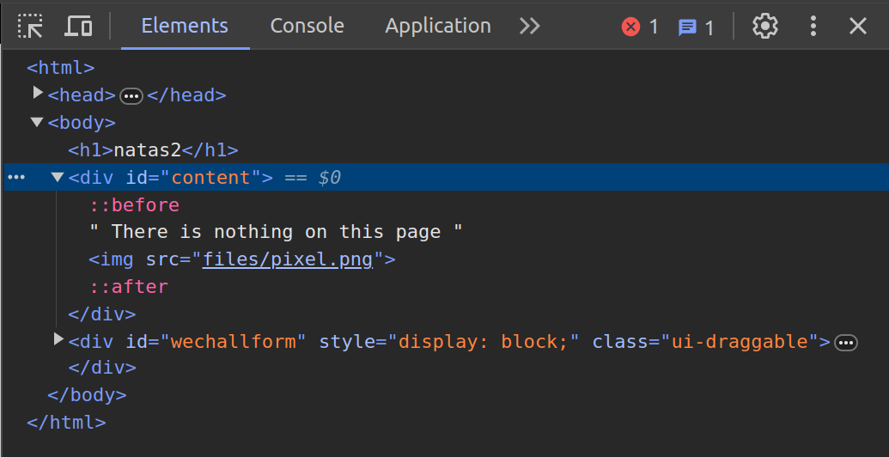
- This suggests that `files/` might exist, let's try visiting `http://natas2.natas.labs.overthewire.org/files`
    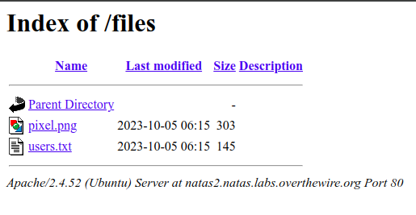
- Open `users.txt`
    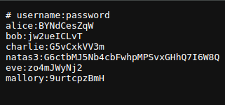
- We found the password for level 3
    `natas3:G6ctbMJ5Nb4cbFwhpMPSvxGHhQ7I6W8Q`
##### What did we learnt from this level?
This is called Directory Listing. We must configure our web server to not list the contents of the directory to prevent from exposing the sensitive data.
More on: https://portswigger.net/kb/issues/00600100_directory-listing

#### Level 3
Username: natas3
Password: G6ctbMJ5Nb4cbFwhpMPSvxGHhQ7I6W8Q
URL:      http://natas3.natas.labs.overthewire.org

- The page says, "There is nothing on this page"
    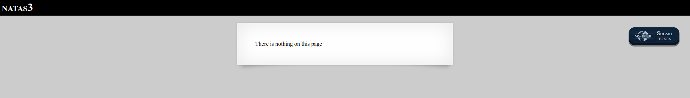
- Open Developer Tools (press `F12`)
    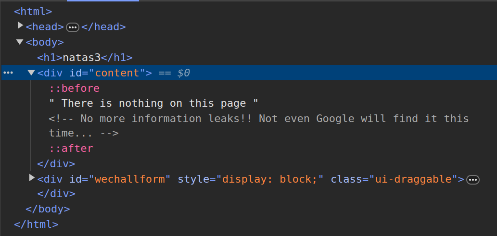
    There is a comment which reads,
    ```html
    <!-- No more information leaks!! Not even Google will find it this time... -->
    ```
Now think from the developer's perspective, not from the attacker's perspective. The developer wants to stop us from finding the route
- Using a simple google search:
    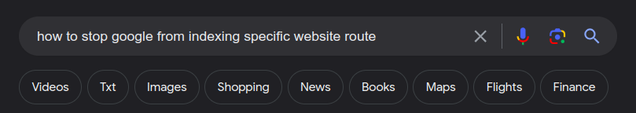
    I found the following StackOverflow link 
    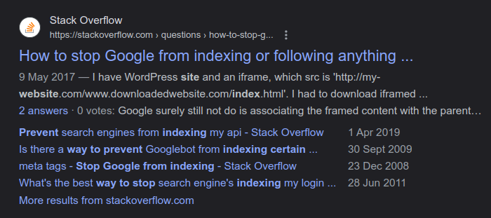
    https://stackoverflow.com/questions/43863542/how-to-stop-google-from-indexing-or-following-anything-inside-a-directory

    There are two answers on the question:
    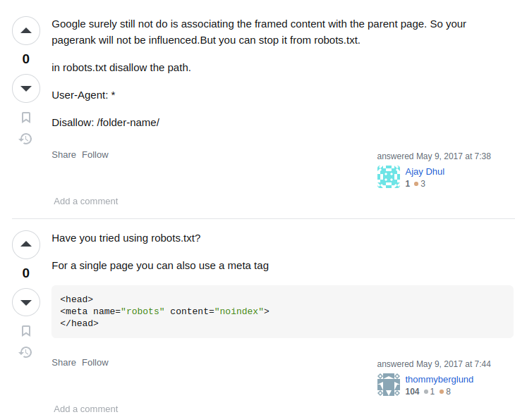

    The first answer says something about `robots.txt`, let's search what is that

    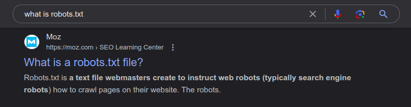
    https://moz.com/learn/seo/robotstxt

    Using the above article we found we can visit `/robots.txt`

- Visit `/robots.txt`
    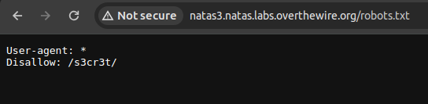
    We found `/s3cr3t` exist, let's visit it 

- Again we found the `users.txt`
    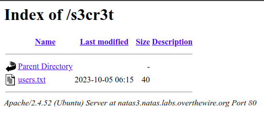
- Open `users.txt`
    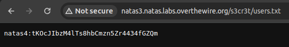

#### Level 4 
Username: natas4
Password: tKOcJIbzM4lTs8hbCmzn5Zr4434fGZQm
URL:      http://natas4.natas.labs.overthewire.org

- The page reads, Access disallowed. You are visiting from "" while authorized users should come only from "http://natas5.natas.labs.overthewire.org/"
    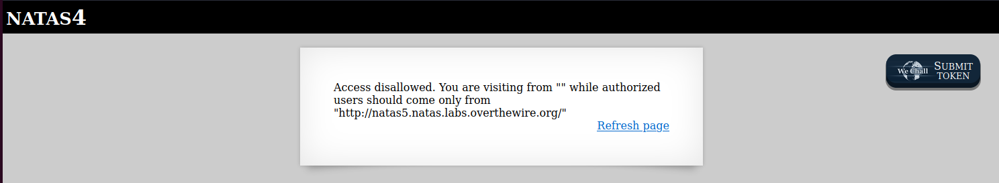

Again think from developer's perspective. In the links provided in prerequisite section, you must have read that HTTP is stateless, so how does the website know from where the request is coming from?

- Using a google search, I found this Stack Overflow question 
    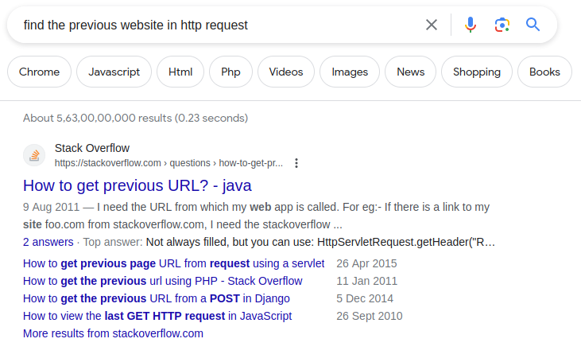
    https://stackoverflow.com/questions/6994936/how-to-get-previous-url

    I found two answers on stack overflow, both are reffering to `HTTP Referer`
- Upon further searching, I found that HTTP Referer can lead to the solution: https://developer.mozilla.org/en-US/docs/Web/HTTP/Headers/Referer

- Open Developer Tools (press `F12`) and go to Network Tab:
    In network tab we can examine each and every request going from our browser. After click on `Refresh Page` link and examine the HTTP request in the network tab by clicking on it.
    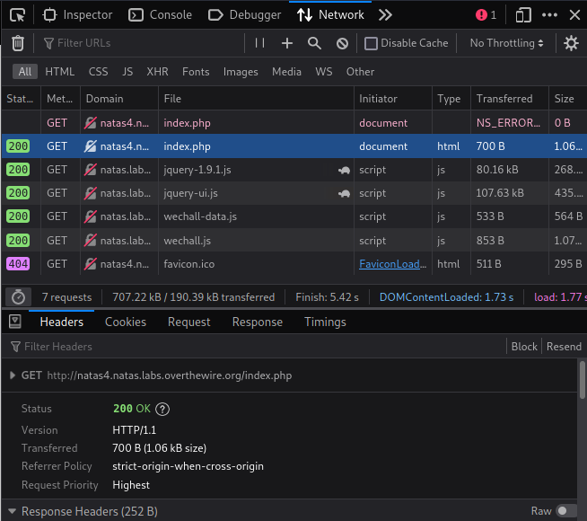

- If we dig deeper and examine the HTTP request Headers, we can see that `Referer` header is present
    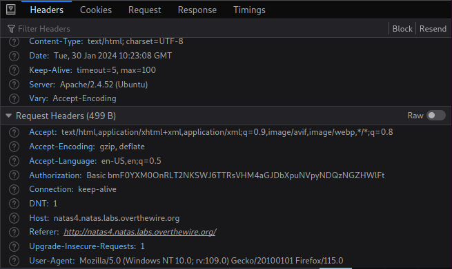
    
    We need a way to change the request header. One of the best tool to intercept the request is `Burp Suite`

- Open Burp Suite and configure your browser to use `Burp Suite` https://portswigger.net/burp/documentation/desktop/external-browser-config

- After setting up the browser, open burp suite 
    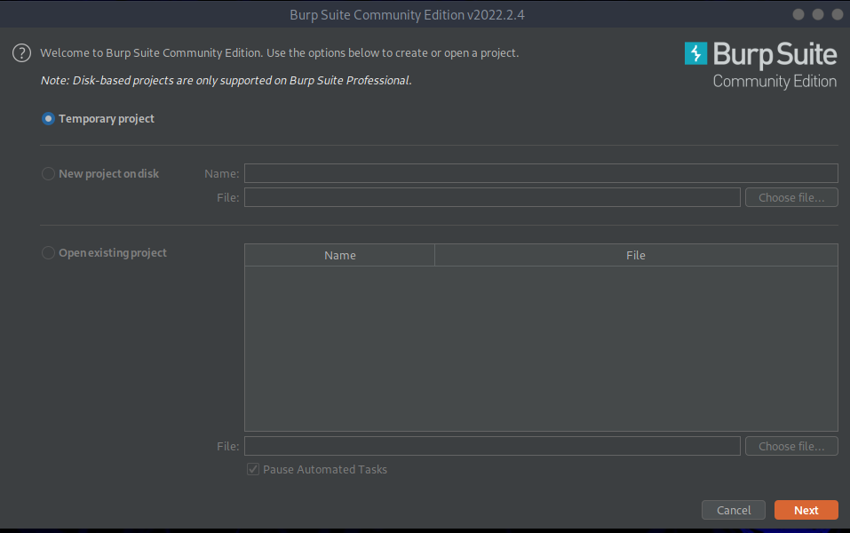

    Click on Next -> Start Burp

    The burp suite will look like the following:
    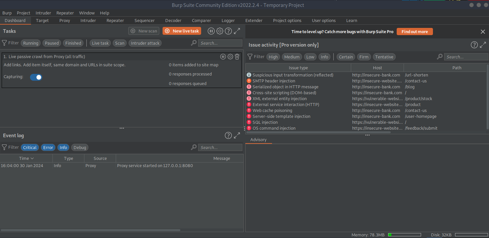

- At the top bar in the left, you will see a Proxy tab, go to proxy tab.
    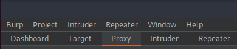

- Turn on the intercept
    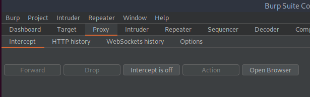

    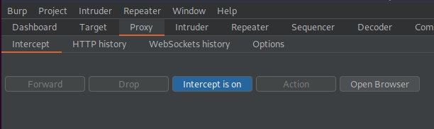

- Now in the browser click on `Refresh Page` to intercept the outgoing request 
    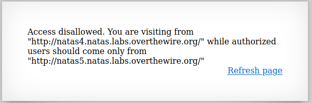

    After clicking, switch to Burp Suite again, you'll see there is an intercepted request

    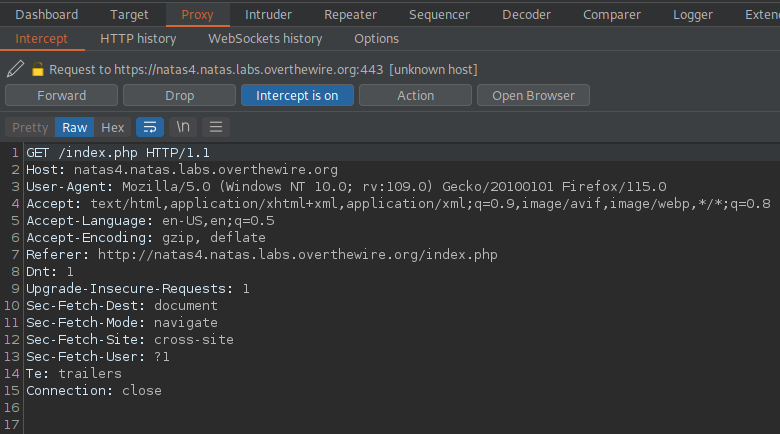

- Change the `Referer` header to `http://natas5.natas.labs.overthewire.org/` because the challenge only allow if the request is coming from this particular website.
    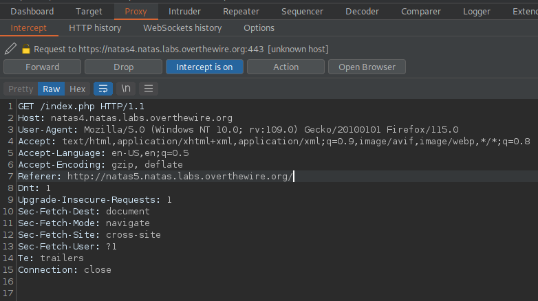

- Click on `Forward` to send the request from Burp Suite proxy to the server
    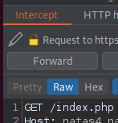

- Go back to browser, the web page now allows us.
    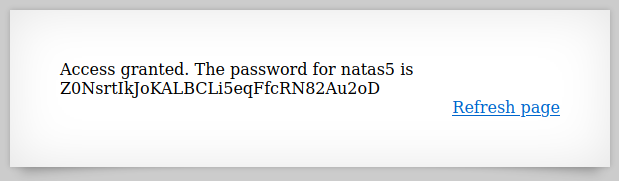

##### What did we learnt from this level?
We should not always trust the HTTP headers, especially for security reasons. They can be changed along the way using proxies.
More on:
https://www.hacksparrow.com/webdev/security/dangers-of-trusting-http-headers.html


#### Level 5
Username: natas5
Password: Z0NsrtIkJoKALBCLi5eqFfcRN82Au2oD
URL:      http://natas5.natas.labs.overthewire.org 

- Practice problem for you.

### Further Reading 
- https://www.offsec.com/offsec/web-application-security-fundamentals/
- https://developer.mozilla.org/en-US/docs/Learn/Server-side/First_steps/Website_security
- https://book.hacktricks.xyz/